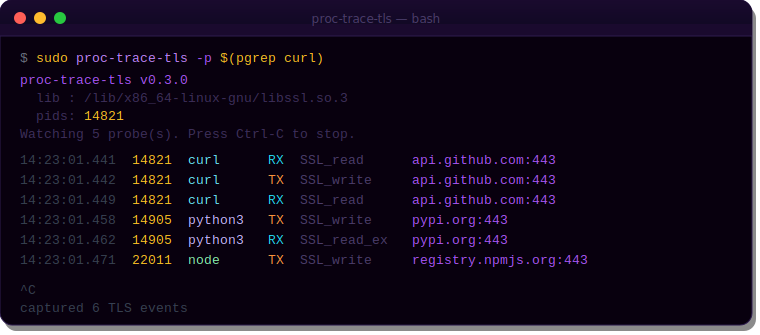
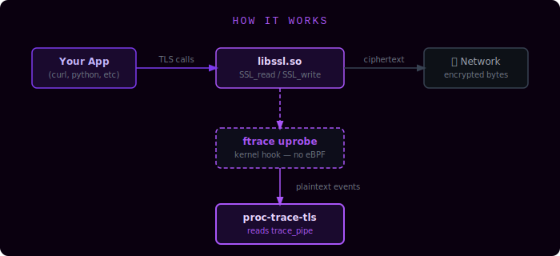

<div align="center">
  
  <h1>proc-trace-tls</h1>
  <p><strong>See plaintext TLS traffic before it's encrypted — in real time, per-process, with zero eBPF and zero ptrace.</strong></p>

  
  
  
  
</div>

---

`proc-trace-tls` attaches **ftrace uprobes** directly to `SSL_read` and `SSL_write` inside `libssl.so`, intercepting plaintext data at the exact moment it passes through OpenSSL — before encryption on the way out, after decryption on the way in. No eBPF. No `ptrace`. No kernel modules. No SSL stripping.

<div align="center">
  
</div>

---

## How it works

<div align="center">
  
</div>

```
App → libssl.so:SSL_write → [ uprobe hook ] → ciphertext → network
                                   ↓
                            ftrace trace_pipe
                                   ↓
                          proc-trace-tls (reads events)
```

The Linux kernel's **ftrace uprobe** infrastructure lets you hook any userspace function at the instruction level. `proc-trace-tls` registers uprobes on `SSL_read` / `SSL_write` (and their `_ex` variants), then reads the event stream from `/sys/kernel/debug/tracing/trace_pipe`. The result: every TLS call by every process, with PID, comm, direction, and timestamp.

No SSL CA needed. No MitM proxy. No network tap. The plaintext is right there in the function arguments.

---

## Features

| Feature | Details |
|---------|---------|
| 🔓 **Plaintext capture** | Hooks `SSL_read` / `SSL_write` before crypto — works regardless of cipher suite or cert pinning |
| 🎯 **Per-process filter** | `-p PID[,PID,...]` to watch specific processes only |
| 🔍 **Auto lib detection** | Scans `/proc/<pid>/maps` and common paths — finds libssl without config |
| 🌐 **System-wide** | No filter = catch all TLS calls on the machine |
| 📊 **Event stream** | Timestamp · PID · process name · direction (RX/TX) · symbol · **remote host** |
| 🌐 **Host resolution** | SNI hostname via `SSL_get_servername` uprobe; falls back to `/proc/<pid>/net/tcp` + reverse DNS. Use `-R` for raw IPs. |
| 🔌 **Zero deps** | Single static binary; requires only debugfs and root |
| 🎨 **Color output** | ANSI colors auto-detected when stdout is a tty |
| 📝 **Log to file** | `-o FILE` streams events to disk |

---

## Requirements

- Linux kernel ≥ 4.17 (uprobe support in ftrace — on all major distros since 2018)
- `debugfs` mounted at `/sys/kernel/debug` (default on all major distros)
- Root or `CAP_SYS_ADMIN` + `CAP_DAC_OVERRIDE`
- OpenSSL / libssl installed on the target system

---

## Install

### Download a release binary

```bash
# amd64
curl -fsSL https://github.com/binRick/proc-trace-tls/releases/latest/download/proc-trace-tls-linux-amd64 \
  -o /usr/local/bin/proc-trace-tls && chmod +x /usr/local/bin/proc-trace-tls

# arm64
curl -fsSL https://github.com/binRick/proc-trace-tls/releases/latest/download/proc-trace-tls-linux-arm64 \
  -o /usr/local/bin/proc-trace-tls && chmod +x /usr/local/bin/proc-trace-tls
```

### Install RPM (RHEL/AlmaLinux/Rocky)

```bash
rpm -i https://github.com/binRick/proc-trace-tls/releases/latest/download/proc-trace-tls-*.rpm
```

---

## Build

### Docker — no local Go needed

```bash
chmod +x build.sh
./build.sh
# → binaries in ./dist/
#   proc-trace-tls-linux-amd64
#   proc-trace-tls-linux-arm64
```

### From source

```bash
go build -o proc-trace-tls .
```

### Static binary

```bash
CGO_ENABLED=0 go build -ldflags="-s -w" -o proc-trace-tls .
```

---

## Usage

```
proc-trace-tls [-achqQsvR] [-l LIB] [-o FILE] [-p PID[,PID,...]]
```

### Watch all TLS traffic system-wide

```bash
sudo proc-trace-tls
```

```
proc-trace-tls v0.1.0
  lib : /lib/x86_64-linux-gnu/libssl.so.3
  pids: all
Watching 4 probe(s). Press Ctrl-C to stop.

14:23:01.441  14821  curl      RX  SSL_read     api.github.com:443
14:23:01.442  14821  curl      TX  SSL_write    api.github.com:443
14:23:01.449  14821  curl      RX  SSL_read     api.github.com:443
14:23:01.458  14905  python3   TX  SSL_write    pypi.org:443
14:23:01.462  14905  python3   RX  SSL_read_ex  pypi.org:443
```

### Trace a specific process

```bash
sudo proc-trace-tls -p $(pgrep nginx)
```

### Use a custom libssl path

```bash
sudo proc-trace-tls -l /usr/lib64/libssl.so.3
```

### Log to file, summary mode

```bash
sudo proc-trace-tls -sq -o /var/log/tls-events.log
```

---

## Flags

| Flag | Description |
|------|-------------|
| `-c` | Force color output (auto-detected on tty) |
| `-l LIB` | Path to `libssl.so` (auto-detected if omitted) |
| `-o FILE` | Log to FILE instead of stdout |
| `-p PID[,...]` | Trace only these PIDs (comma-separated) |
| `-q` | Suppress startup messages |
| `-Q` | Suppress error messages |
| `-R` | Skip reverse DNS — show raw `IP:port` instead of hostname |
| `-s` | Summary only — no payload lines |
| `-v` | Verbose probe registration output |
| `-h` | Show help |

---

## Use cases

**🔐 Security research** — see what data an app sends over TLS without a MitM proxy, cert pinning bypass, or CA install. Works even with certificate pinning.

**🐛 API debugging** — inspect the raw plaintext HTTP/1.1 or HTTP/2 frames your application sends and receives, without modifying the app or its config.

**📦 Third-party auditing** — verify what a closed-source binary is transmitting over its encrypted connections before you trust it on your network.

**🎓 Learning TLS** — watch the TLS handshake data flow in real time. See what a `curl` request actually looks like after decryption.

**🔍 Incident response** — on a compromised host, see exactly what data malware is exfiltrating over HTTPS without needing to decrypt the pcap.

---

## How it differs from alternatives

| Tool | Mechanism | eBPF required | Kernel module | Affects app | Works with pinning |
|------|-----------|:---:|:---:|:---:|:---:|
| **proc-trace-tls** | ftrace uprobes | ❌ | ❌ | ❌ | ✅ |
| `bcc ssl_sniff` | eBPF uprobes | ✅ | ❌ | ❌ | ✅ |
| `mitmproxy` | MitM proxy | ❌ | ❌ | ✅ | ❌ |
| `ssldump` | pcap + keys | ❌ | ❌ | ❌ | ❌ |
| `strace` | ptrace | ❌ | ❌ | ✅ (slow) | ✅ |

---

## Notes

- **GnuTLS / NSS**: Support for `gnutls_record_send` / `PR_Write` (Firefox) is planned but not yet implemented.
- **Static binaries**: Apps compiled with a bundled, statically linked OpenSSL (some Go binaries, some musl builds) will not be intercepted, as there is no shared `libssl.so` to uprobe.
- **Kernel version**: Tested on kernels 5.15, 6.1, 6.6, and 6.12. Any kernel ≥ 4.17 with debugfs should work.

---

<div align="center">
  <p>
    <a href="https://proc-trace-tls.ximg.app">proc-trace-tls.ximg.app</a>
    &nbsp;·&nbsp; written in Go &nbsp;·&nbsp; Linux only &nbsp;·&nbsp; requires <code>CAP_SYS_ADMIN</code>
  </p>
</div>
